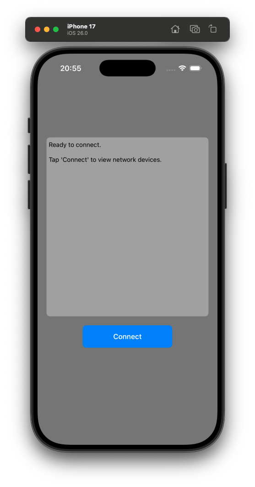
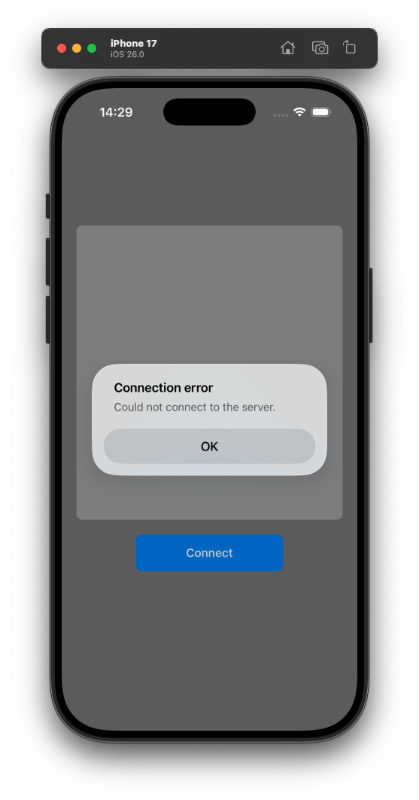
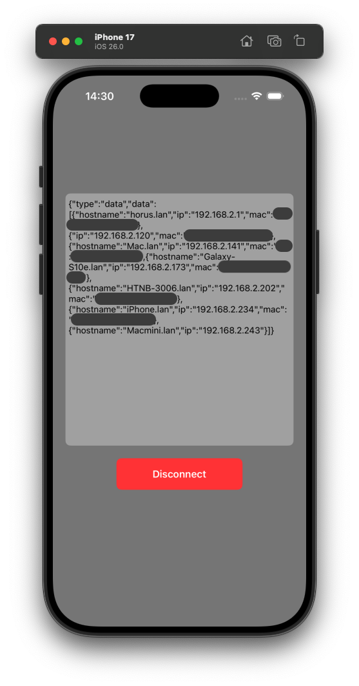

# network-monitor

A network monitoring system that scans the specified subnet and streams device information to connected clients via WebSockets.

## Features

- Server (macOS): scans the specified subnet using `nmap -sn` (ping scan) and broadcasts discovered devices to clients via WebSockets (Swift)
- iOS client: displays the devices, see [Preview (iOS)](#preview-ios) (Objective-C, UIKit)
- TODO: Android client

## Requirements

- iOS 26.0+
- macOS 15.6+
- Xcode 26.0.1+

## Usage

Server:

> Note: it is simpler to use environmental variables than command line arguments, see [this explanation](https://forums.swift.org/t/how-to-add-custom-arguments-to-vapors-serve-command/74406).

```
$ sudo SUBNET=192.168.2.0/24 ./build/arm64-apple-macosx/debug/server
[ NOTICE ] Server started on http://127.0.0.1:8080
[ INFO ] GET /data [request-id: 51F231EC-DF42-406A-8937-5F3962F3C42B]
received: {"type":"subscribe"}

subscribed with id: 7D72BE77-AD6C-4153-A595-8DB112A7A71D
sent: {"message":"subscribed","type":"ack"}
sent: {"type":"data","data":[{"ip":"192.168.2.1","mac":"XX:XX:XX:XX:XX:XX","hostname":"horus.lan"},{"ip":"192.168.2.120","mac":"XX:XX:XX:XX:XX:XX"},{"ip":"192.168.2.141","mac":"XX:XX:XX:XX:XX:XX","hostname":"Mac.lan"},{"ip":"192.168.2.173","mac":"XX:XX:XX:XX:XX:XX","hostname":"Galaxy-S10e.lan"},{"ip":"192.168.2.202","mac":"XX:XX:XX:XX:XX:XX","hostname":"HTNB-3006.lan"},{"ip":"192.168.2.234","mac":"XX:XX:XX:XX:XX:XX","hostname":"iPhone.lan"},{"ip":"192.168.2.243","hostname":"Macmini.lan"}]}
received: {"type":"unsubscribe"}

unsubscribed with id: 7D72BE77-AD6C-4153-A595-8DB112A7A71D
sent: {"message":"unsubscribed","type":"ack"}
```

Client:

> Note: we use `websocat` here to test the server with a simple client. The "real" clients are the iOS and Android apps.

```
$ websocat ws://127.0.0.1:8080/data                      
{"type":"subscribe"}
{"message":"subscribed","type":"ack"}
{"type":"data","data":[{"ip":"192.168.2.1","mac":"XX:XX:XX:XX:XX:XX","hostname":"horus.lan"},{"ip":"192.168.2.120","mac":"XX:XX:XX:XX:XX:XX"},{"ip":"192.168.2.141","mac":"XX:XX:XX:XX:XX:XX","hostname":"Mac.lan"},{"ip":"192.168.2.173","mac":"XX:XX:XX:XX:XX:XX","hostname":"Galaxy-S10e.lan"},{"ip":"192.168.2.202","mac":"XX:XX:XX:XX:XX:XX","hostname":"HTNB-3006.lan"},{"ip":"192.168.2.234","mac":"XX:XX:XX:XX:XX:XX","hostname":"iPhone.lan"},{"ip":"192.168.2.243","hostname":"Macmini.lan"}]}
{"type":"unsubscribe"}
{"message":"unsubscribed","type":"ack"}
```

## Preview (iOS)

<p align="center">
  
  
  
</p>

## Command cheatsheet

### Server

#### Build

```
$ swift build --build-path build
```

Alternatively:

```
$ xcodebuild build -scheme server -derivedDataPath build -destination 'platform=macOS,arch=arm64' -quiet
```

#### Run

```
$ sudo ./build/arm64-apple-macosx/debug/server
```

Alternatively:

```
$ sudo ./build/Build/Products/Debug/server
```

#### Format Swift

```
$ brew install swift-format
$ swift-format -i -r Sources/
```

#### Lint Swift

```
$ brew install swiftlint
$ swiftlint --strict Sources/
```

### iOS client

#### Build

```
$ xcodebuild -scheme ios-client build -derivedDataPath build -destination 'platform=iOS Simulator,arch=arm64,name=iPhone 17' -quiet
```

#### Run

```
$ xcrun simctl boot "iPhone 17"
$ open -a Simulator
$ xcrun simctl install "iPhone 17" build/Build/Products/Debug-iphonesimulator/ios-client.app
$ xcrun simctl launch "iPhone 17" gemesa.ios-client
```

#### Terminate

```
$ xcrun simctl terminate "iPhone 17" gemesa.ios-client
```

#### Format Objective-C

```
$ find ios-client/ -name "*.m" -o -name "*.h" | xargs clang-format -i
```

#### Analyze Objective-C

```
$ xcodebuild analyze -scheme ios-client -destination 'platform=iOS Simulator,name=iPhone 17' -quiet GCC_TREAT_WARNINGS_AS_ERRORS=YES
```
